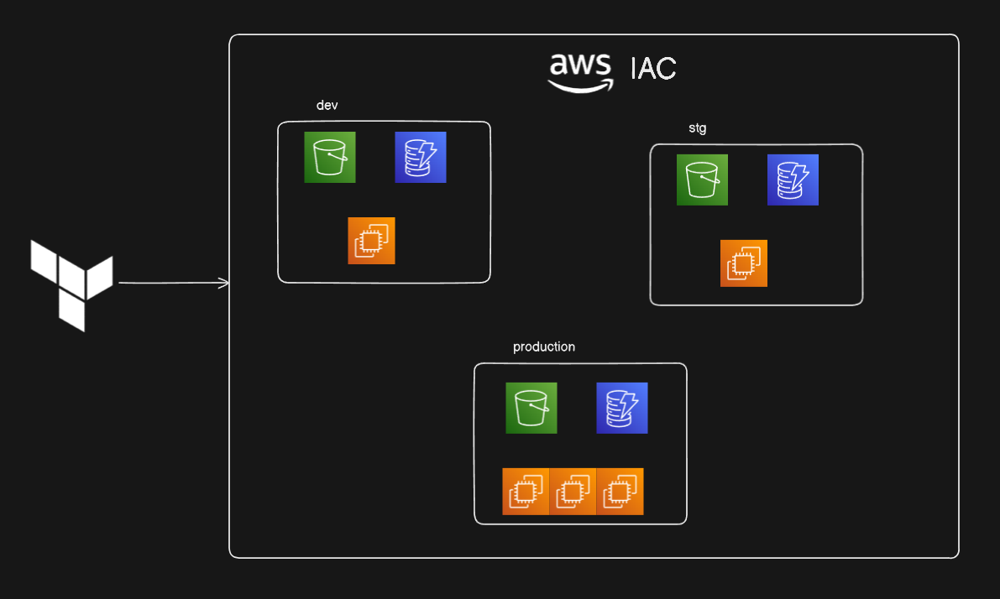

# Terraform AWS S3 Bucket Configuration

## Overview

This Terraform configuration creates an AWS S3 bucket with environment-specific settings and tags. It includes additional configurations such as versioning, lifecycle policies, and logging to manage the bucket effectively. The setup also includes EC2 instance provisioning based on environment variables provided in `.tfvars` files for different environments like `dev`, `stg`, and `prod`.



## Resources

- **AWS S3 Bucket**: Creates an S3 bucket with environment-specific naming and tagging.
- **EC2 Instance**: Provisions EC2 instances based on environment-specific configuration files.
- **Versioning**: Enabled for object versioning.
- **Lifecycle Policy**: Protects the bucket from accidental destruction.
- **Logging**: Configured for server access logging.

## Variables

### `my_evn`
- **Type**: `string`
- **Description**: Environment variable used to name the bucket and tags.

### `ami_id`
- **Type**: `string`
- **Description**: AMI ID for the EC2 instance.

### `instance_type`
- **Type**: `string`
- **Description**: The type of EC2 instance.

### `instance_count`
- **Type**: `number`
- **Description**: The number of EC2 instances.

## Configuration Files

### `main.tf`
The `main.tf` file calls the module from the `aws_infra` directory and sets up the infrastructure using variables provided by the `dev.tfvars`, `stg.tfvars`, and `prod.tfvars` files.

### Environment-Specific Files

You need to create different `.tfvars` files for each environment (`dev`, `stg`, `prod`). Each file will provide the necessary values for the variables to set up infrastructure in that environment.

#### `dev.tfvars`
```hcl
my_evn         = "dev"
ami_id         = "ami-xxxxxxxx" # Replace with valid AMI ID
instance_type  = "t2.micro"
instance_count = 1
```

#### `stg.tfvars`
```hcl
my_evn         = "stg"
ami_id         = "ami-xxxxxxxx" # Replace with valid AMI ID
instance_type  = "t2.medium"
instance_count = 1
```

#### `prod.tfvars`
```hcl
my_evn         = "prod"
ami_id         = "ami-xxxxxxxx" # Replace with valid AMI ID
instance_type  = "t2.large"
instance_count = 3
```

## Usage

1. **Clone the Repository**

   ```bash
   git clone https://github.com/SHIVANIUM-GIT/terraform-aws-s3-setup
   cd terraform-aws-s3-setup
   ```

2. **Initialize Terraform**

   Initialize your Terraform configuration to download the necessary providers.

   ```bash
   terraform init
   ```

3. **Plan the Deployment**

   Review the changes that will be applied by Terraform for each environment.

   For development environment:
   ```bash
   terraform plan -var-file="dev.tfvars"
   ```

   For staging environment:
   ```bash
   terraform plan -var-file="stg.tfvars"
   ```

   For production environment:
   ```bash
   terraform plan -var-file="prod.tfvars"
   ```

4. **Apply the Configuration**

   Apply the configuration to create the S3 bucket and other resources.

   For development environment:
   ```bash
   terraform apply -var-file="dev.tfvars"
   ```

   For staging environment:
   ```bash
   terraform apply -var-file="stg.tfvars"
   ```

   For production environment:
   ```bash
   terraform apply -var-file="prod.tfvars"
   ```

   Confirm the action by typing `yes` when prompted.

5. **Verify the Bucket and EC2 Instances**

   Check the AWS S3 console and EC2 dashboard or use the AWS CLI to verify the creation of resources.

## Best Practices

- **Bucket Name Uniqueness**: Ensure the bucket name is unique globally.
- **Versioning**: Enable versioning to keep multiple versions of objects.
- **Lifecycle Policies**: Manage storage class and retention of objects.
- **Access Control**: Configure bucket policies carefully to manage access.
- **Logging**: Enable server access logging for auditing and monitoring.

## Security

- **Protect Private Keys**: Ensure that private keys are managed securely and not exposed.
- **Avoid Public Access**: Configure access policies to prevent unintended public access.

<<<<<<< HEAD
## License

This project is licensed under the MIT License - see the [LICENSE](LICENSE) file for details.
=======
>>>>>>> 1186eecdc1e491a6f772993d6de46b8f3fdabe50
